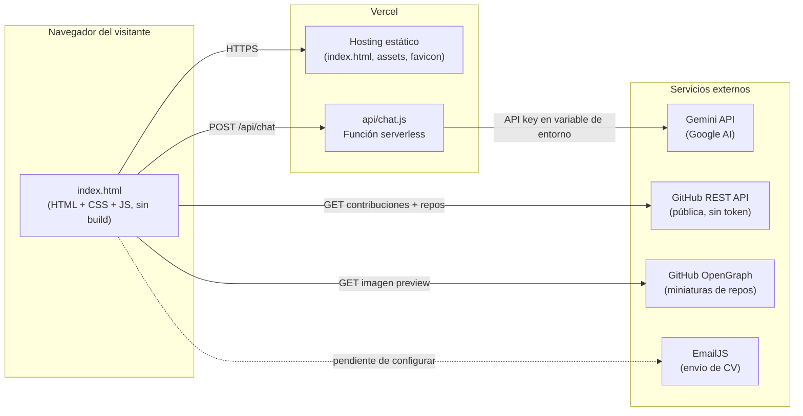
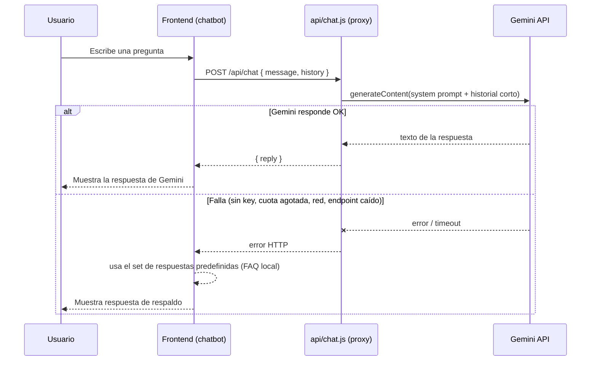
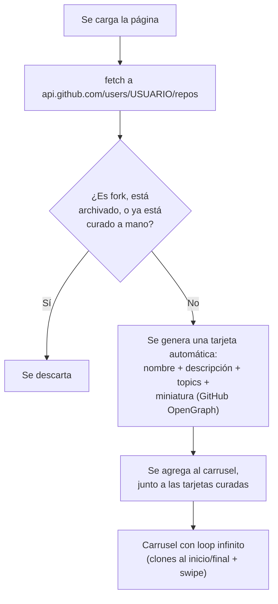

# Portfolio — Javier Fiestas


Landing page de portafolio personal de **Javier Fiestas Calixto** — Bachiller en
Ingeniería de Sistemas, Analista de Datos y Automatización. Este documento es
un reporte técnico del proyecto: cómo está construido, qué tecnologías usa,
qué conexiones/integraciones externas hace y cómo se relacionan entre sí.

**Sitio en vivo:** _(agregar la URL de Vercel/dominio final aquí)_

<!-- Sugerencia: agregar una captura de pantalla del sitio acá, por ejemplo:
 -->

---

## Tabla de contenidos

- [Descripción del proyecto](#descripción-del-proyecto)
- [Características principales](#características-principales)
- [Arquitectura](#arquitectura)
  - [Vista general](#vista-general)
  - [Flujo del chatbot](#flujo-del-chatbot)
  - [Flujo del carrusel de proyectos](#flujo-del-carrusel-de-proyectos)
- [Stack tecnológico](#stack-tecnológico)
- [Conexiones e integraciones externas](#conexiones-e-integraciones-externas)
- [Seguridad](#seguridad)
- [Estructura del proyecto](#estructura-del-proyecto)
- [Cómo ejecutarlo localmente](#cómo-ejecutarlo-localmente)
- [Roadmap](#roadmap)
- [Contacto](#contacto)

---

## Descripción del proyecto

Es un sitio de portafolio de una sola página (single-page), construido como
**HTML/CSS/JS estático puro** — sin frameworks de frontend ni proceso de
build — más **una función serverless** para las partes que necesitan un
secreto de servidor (la conexión con la IA). La idea detrás del diseño fue
que cada sección no fuera solo texto estático, sino que reflejara
directamente las habilidades técnicas del perfil: un calendario de
contribuciones armado con datos reales de la API de GitHub, un chatbot
conectado a un modelo de lenguaje de verdad, y un carrusel de proyectos que
se actualiza solo a medida que se suben nuevos repositorios públicos.

## Características principales

- **Hero con laptop virtual**: una laptop flotante en CSS 3D cuya pantalla
  muestra, en bucle, los logos de las tecnologías principales del stack.
- **Robot flotante + chatbot con IA real**: conectado a la API de Gemini a
  través de una función serverless (la API key nunca llega al navegador).
  Tiene un system prompt con el perfil profesional completo y reglas de
  estilo (respuestas breves, sin salirse de tema, sin Markdown). Si la
  llamada a Gemini falla por cualquier motivo, cae automáticamente a un set
  de respuestas predefinidas por palabra clave, así el chatbot nunca se
  queda roto.
- **Calendario de contribuciones de GitHub en vivo**: calendario propio
  (mismo tamaño/color/cantidad de cuadros que github.com) armado con datos
  reales del año en curso, con tooltips por día y celdas de ancho fluido
  que llenan el contenedor.
- **Carrusel de proyectos con auto-sincronización**: dos proyectos curados a
  mano, más cualquier otro repositorio público nuevo que se agregue a la
  cuenta de GitHub — se suma solo, con su descripción, topics y una
  miniatura generada automáticamente. Carrusel de una tarjeta a la vez, con
  swipe táctil, flechas y loop infinito en ambos sentidos.
- **"Solicitar CV" por correo**: modal que pide el correo del visitante y
  envía el CV en PDF automáticamente (vía EmailJS).
- **Selector de 5 idiomas**: español, inglés, portugués, francés y chino,
  con banderas, sin recargar la página.
- **Modo claro/oscuro**, diseño responsive, colores de marca por tecnología
  en cada tag/skill, y accesibilidad básica (roles ARIA, foco de teclado,
  `prefers-reduced-motion`).

## Arquitectura

### Vista general



La idea central: el sitio es **100% estático** (se puede servir desde
cualquier CDN), y la **única pieza con backend** es `api/chat.js`, que
existe exclusivamente porque la API key de Gemini no puede exponerse en el
navegador. Todo lo demás (calendario de GitHub, carrusel de proyectos)
llama directo a APIs públicas que no requieren autenticación.

### Flujo del chatbot



El historial que se manda a Gemini se recorta a los últimos mensajes (no
toda la conversación) para ahorrar tokens, y el modelo corre con
`thinkingLevel: "low"` para minimizar el razonamiento interno invisible que
consumen los modelos Gemini 3.x — ambos ajustes se calibraron con datos
reales de uso de tokens en producción.

### Flujo del carrusel de proyectos



## Stack tecnológico

| Capa | Tecnología |
|---|---|
| Estructura y estilos | HTML5, CSS3 (Grid, Flexbox, custom properties, animaciones) |
| Lógica de frontend | JavaScript vanilla (sin frameworks ni bundler) |
| Backend | Función serverless en Node.js (runtime de Vercel) |
| Hosting | Vercel (sitio estático + función serverless en el mismo despliegue) |
| IA conversacional | Google Gemini API (`gemini-3.6-flash` por defecto) |
| Tipografías | Google Fonts (Playfair Display, Plus Jakarta Sans, Caveat) |
| Iconografía | Font Awesome 6, flag-icons (banderas del selector de idioma) |
| Envío de correo | EmailJS (`@emailjs/browser`) |
| Control de versiones | Git + GitHub |

## Conexiones e integraciones externas

| Integración | Uso | Autenticación |
|---|---|---|
| **Google Gemini API** | Motor de respuestas del chatbot | API key guardada como variable de entorno en Vercel, nunca expuesta al cliente |
| **GitHub REST API** (`api.github.com`) | Calendario de contribuciones y listado de repos públicos para el carrusel de proyectos | Pública, sin token (datos públicos, límite de tasa estándar de GitHub) |
| **GitHub OpenGraph** (`opengraph.githubassets.com`) | Miniaturas automáticas para las tarjetas de proyectos auto-generadas | Pública, sin token |
| **EmailJS** | Envío del CV en PDF al correo que ingresa el visitante | Public key + plantilla configurada en el dashboard de EmailJS |
| **Vercel** | Hosting del sitio estático y de la función serverless `api/chat.js` | Variables de entorno del proyecto |

## Seguridad

- La API key de Gemini vive **exclusivamente** como variable de entorno del
  lado del servidor (`api/chat.js` corriendo en Vercel) — nunca se incluye
  en el HTML/JS que descarga el navegador, precisamente porque cualquier
  clave puesta ahí quedaría visible con solo inspeccionar el código fuente.
- `api/chat.js` valida el método HTTP, limita el tamaño de los mensajes, y
  responde con CORS configurable por variable de entorno.
- El sitio se queda en el **nivel gratuito** de Gemini a propósito: pone un
  techo natural de costo en $0 — si alguien abusa del endpoint, se topa con
  el límite de cuota gratuita en vez de generar una factura.
- Ningún secreto real vive en este repositorio ni en su historial (`.env`,
  `.env.local` y `.vercel` están en `.gitignore`; `.env.example` es solo una
  plantilla sin valores).

## Estructura del proyecto

```
index.html          Todo el frontend: HTML + CSS + JS (sin build)
favicon.svg          Ícono del sitio
api/
  chat.js            Función serverless: proxy hacia la API de Gemini
.env.example          Plantilla de variables de entorno (sin valores reales)
Animation/
  Laptop/            Fotos de referencia de la laptop del hero
  Snorlax/           Sprites de una animación anterior (sin uso actual)
  Tecnologias/       Logos de tecnologías que se muestran en el laptop virtual
  U/                 Logo de la Universidad de Lima
```

## Cómo ejecutarlo localmente

El sitio no necesita build ni servidor para las partes estáticas — alcanza
con abrir `index.html` en el navegador. Para probar el chatbot con Gemini
funcionando localmente hace falta la CLI de Vercel (para simular la función
serverless):

```bash
npm i -g vercel
vercel dev
```

Copiar `.env.example` a `.env` y completar `GEMINI_API_KEY` con una key
propia de [Google AI Studio](https://aistudio.google.com/apikey) antes de
correr `vercel dev`.

## Roadmap

- [ ] Configurar EmailJS con credenciales reales (hoy el modal de "Solicitar
      CV" avisa que el envío automático no está configurado).
- [ ] Traducir el chatbot a los otros 4 idiomas del selector.
- [ ] Afinar aún más el system prompt del chatbot según el uso real.
- [ ] Reemplazar los íconos de las tarjetas de proyectos curadas por
      capturas de pantalla reales.

## Contacto

- **LinkedIn:** [linkedin.com/in/javier-fiestas](https://www.linkedin.com/in/javier-fiestas-6457ba240/)
- **GitHub:** [@Javier3921](https://github.com/Javier3921)
- **Correo:** javierfiestas44@gmail.com
